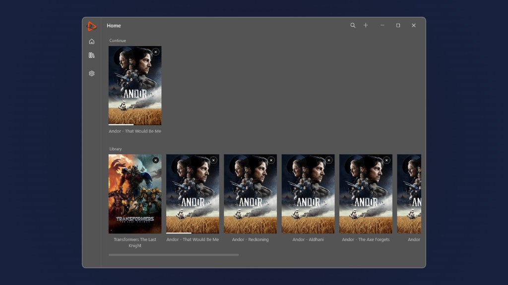

# Defuse

Paste a link, save it, and play it inside the app. Progress stays on this device.

Infuse is a usability reference only: the name, graphics, layout, and branding here are not Infuse's.

## Download

<table>
  <tr>
    <th align="left">OS</th>
    <th align="left">Download</th>
  </tr>
  <tr>
    <td>Linux</td>
    <td>
      
      
      
    </td>
  </tr>
  <tr>
    <td>Windows</td>
    <td>
      
      
    </td>
  </tr>
  <tr>
    <td>macOS</td>
    <td>
      Sequoia or later
      
    </td>
  </tr>
  <tr>
    <td>Android</td>
    <td>
      
    </td>
  </tr>
</table>

Linux portable builds need the VLC package from your distribution (`vlc` on Debian, Ubuntu, and Fedora). Unzip or untar, then run `Defuse`. Install the Flatpak with `flatpak install Defuse-linux-x64.flatpak`. On macOS, open the disk image and run Defuse; if Gatekeeper blocks it, open it once from System Settings.

The Windows app is the WPF player in `src/Desktop`. Linux and macOS share `src/App`. Android is `src/Android`.

No license file is included until a license is chosen.
